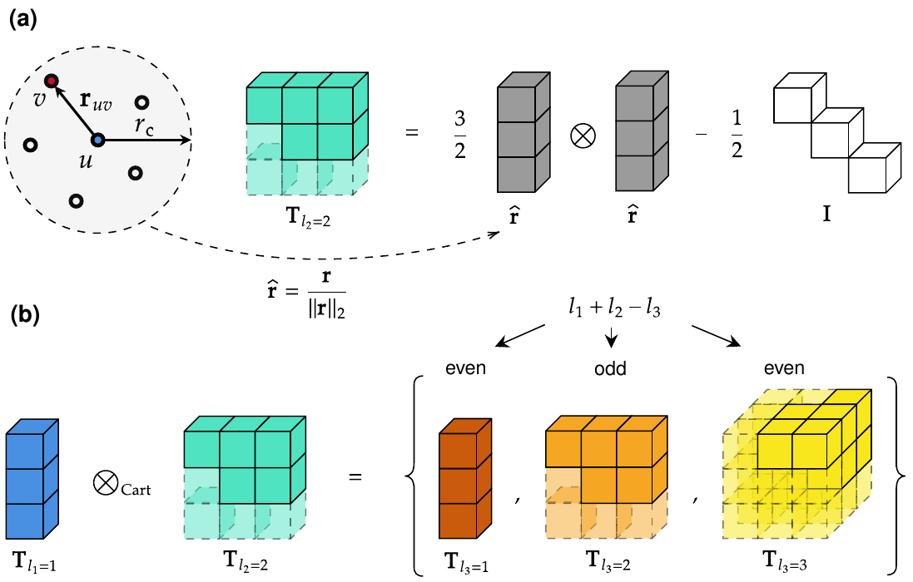
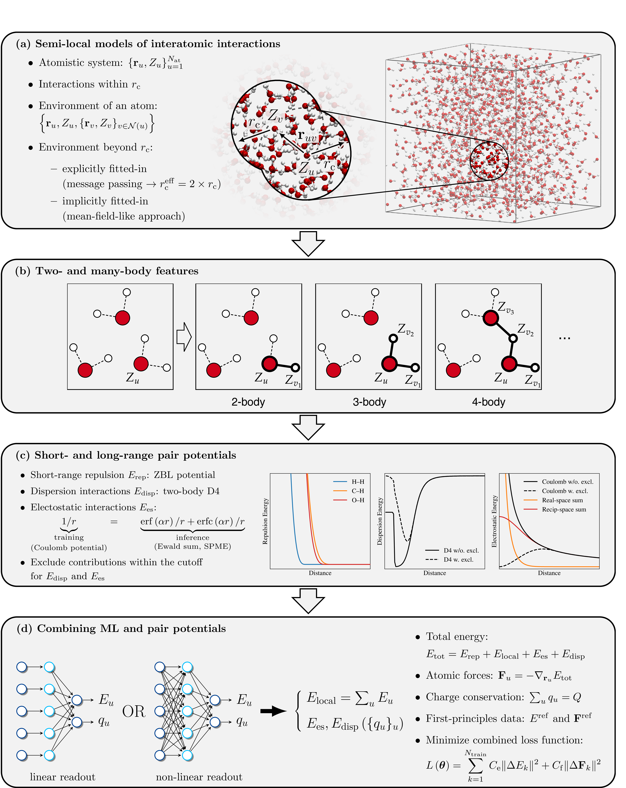

# ICTP: Irreducible Cartesian Tensor Potentials

Official repository for the [paper](https://arxiv.org/abs/2405.14253) _"Higher Rank Irreducible Cartesian Tensors for Equivariant Message Passing"_. It is built upon the [ALEBREW](https://github.com/nec-research/alebrew) repository and implements irreducible Cartesian tensors and their products.

**Note:** The codebase now also includes implementations of short- and long-range pair potentials, such as ZBL, two-body D4, and Coulomb potentials, including both Ewald summation and smooth particle mesh Ewald (SPME) methods. For further details, we refer to our [paper](https://arxiv.org/abs/2508.10841) _"Performance of universal machine-learned potentials with explicit long-range interactions in biomolecular simulations"_.

**Note:** We additionally now have a [workshop submission](https://openreview.net/forum?id=ssfrYXdQ4x) _"Transferable long-range interactions in machine-learned interatomic potentials"_ which discusses our implementations of short- and long-range pair potentials in greater detail and evaluates them on the synthetic point-charge datasets available at https://doi.org/10.5281/zenodo.17652033.

## Citing us

Please consider citing us if you find the code and paper useful:

    @misc{zaverkin2024higherrankirreduciblecartesiantensors,
        title={Higher-Rank Irreducible Cartesian Tensors for Equivariant Message Passing}, 
        author={Viktor Zaverkin and Francesco Alesiani and Takashi Maruyama and Federico Errica and Henrik Christiansen and Makoto Takamoto and Nicolas Weber and Mathias Niepert},
        year={2024},
        eprint={2405.14253},
        archivePrefix={arXiv},
        primaryClass={cs.LG},
        url={https://arxiv.org/abs/2405.14253}, 
    }

If you are using the ICTP models with analytic pair potentials:

    @misc{zaverkin2025performanceuniversalmachinelearnedpotentials,
        title={Performance of universal machine-learned potentials with explicit long-range interactions in biomolecular simulations}, 
        author={Viktor Zaverkin and Matheus Ferraz and Francesco Alesiani and Mathias Niepert},
        year={2025},
        eprint={2508.10841},
        archivePrefix={arXiv},
        primaryClass={physics.chem-ph},
        url={https://arxiv.org/abs/2508.10841}, 
    }

If you find the synthetic point-charge datasets useful:

@inproceedings{
    zaverkin2025transferable,
    title={Transferable long-range interactions in machine-learned interatomic potentials},
    author={Viktor Zaverkin and Matheus Ferraz and Francesco Alesiani and Henrik Christiansen and Makoto Takamoto and Federico Errica and Mathias Niepert},
    booktitle={EurIPS 2025 Workshop on SIMBIOCHEM},
    year={2025},
    url={https://openreview.net/forum?id=ssfrYXdQ4x}
}

## Implemented methods

This repository implements:

- Irreducible Cartesian tensors up to a rank of three;
- Irreducible Cartesian tensor products (currently, only even tensor products);
- MACE-like architecture based on irreducible Cartesian tensors and their products;
- Short- and long-range pair potentials, such as ZBL, two-body D4, and Coulomb potentials, including both Ewald summation and smooth PME methods.

## License

This source code is released under a non-commercial license; see `LICENSE.txt` for details.

**Note:** `ictp/utils/dimos/bspline.py` is released under a different license: see `LICENSE_DIMOS.txt`.

## Requirements

An environment with [PyTorch](https://pytorch.org/get-started/locally/) (>=2.3.1) and [ASE](https://wiki.fysik.dtu.dk/ase/) (>=3.22.1) installed.  Also, some other dependencies may be necessary; see the `ictp-cuda.yml` file.

## Installation

First, clone this repository into a directory of your choice `git clone https://github.com/nec-research/ictp.git <dest_dir>`. Then, move to `<dest_dir>` and install the required packages into a conda environment using, e.g., `conda env create -f ictp-cuda.yml`. Finally, set your `PYTHONPATH` environment variable to `export PYTHONPATH=<dest_dir>:$PYTHONPATH`.

## Training potentials with a data set

We provide example scripts for training ICTP models for molecular (`examples/run_training_DHA.py`) and material (`examples/run_training_HEA.py`) systems. For the DHA molecule, first, download the corresponding data set by running `wget http://www.quantum-machine.org/gdml/repo/static/md22_DHA.zip` and unzip it with, e.g., `unzip md22_DHA.zip`. Then, store the `md22_DHA.xyz` file in the `datasets/md22` subfolder and run `python run_training_DHA.py` to train your first ICTP model. The HEA data set can be downloaded from [DaRUS](https://doi.org/10.18419/darus-3516). Please refer to `examples/using_ictp.ipynb` for more details on training ICTP models and using them in, e.g., molecular dynamics simulations.

## How to reproduce the results from the [paper](https://arxiv.org/abs/2405.14253) _"Higher Rank Irreducible Cartesian Tensors for Equivariant Message Passing"_

In the `experiments` subfolder, we provide scripts to reproduce all results from the [paper](https://arxiv.org/abs/2405.14253), along with data preparation scripts in the `datasets` subfolder. For the experiments with the original [MACE](https://github.com/ACEsuit/mace) source code, we used the commit `88d49f9ed6925dec07d1777043a36e1fe4872ff3`.

## How to reproduce the results from the [paper](https://arxiv.org/abs/2508.10841) _"Performance of universal machine-learned potentials with explicit long-range interactions in biomolecular simulations"_

In the `examples/dimos` subfolder, we provide example scripts and input files for all simulated systems. To run these, please install:

- [DIMOS](https://github.com/nec-research/DIMOS/tree/public-branch)
- [PLUMED](https://www.plumed.org/doc-v2.9/user-doc/html/_installation.html)

In the `examples` subfolder, we also provide a script `run_training_SPICE.py` for training ICTP models with short- and long-range pair potentials

## How to reproduce the results from the [workshop submission](https://openreview.net/forum?id=ssfrYXdQ4x) _"Transferable long-range interactions in machine-learned interatomic potentials"_

In the `examples/point_charges` subfolder, we provide example scripts for training and evaluating ICTP models with short- and long-range pair potentials on the point-charge datasets. The `datasets/point_charges` subfolder contains the scripts used to generate these datasets.
